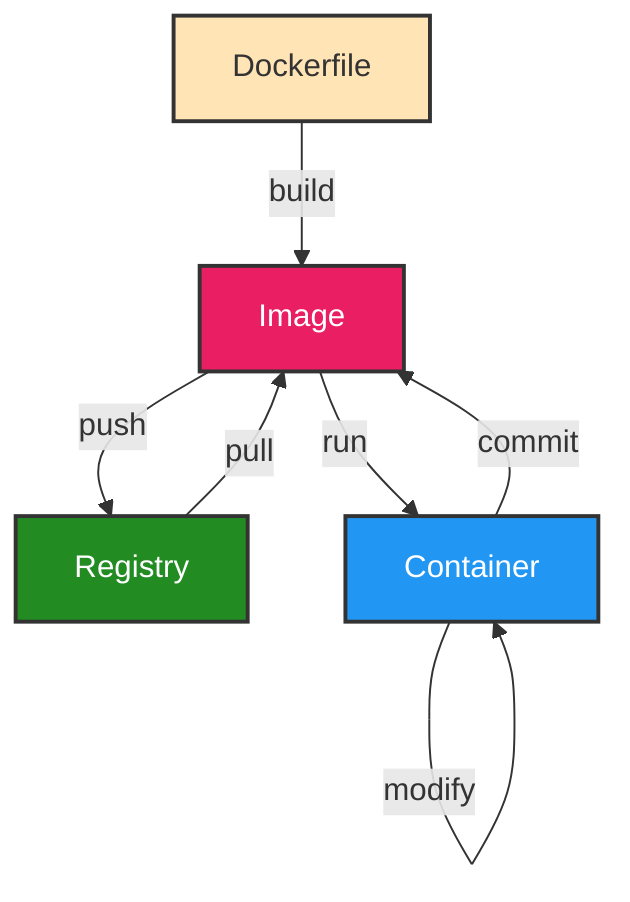
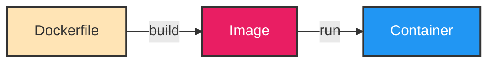
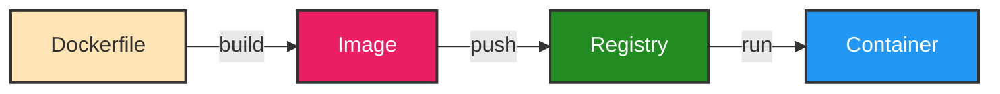
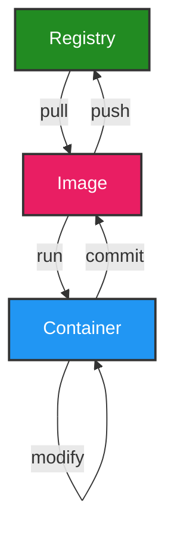

https://www.docker.com

https://hub.docker.com - Pre-built container image registry

https://github.com/veggiemonk/awesome-docker

Newsletter - https://www.docker.com/newsletter-subscription/

Dockerfile linters:

- https://github.com/hadolint/hadolint
- https://www.checkov.io - https://github.com/bridgecrewio/checkov

Colima - Docker Desktop alternative - https://github.com/abiosoft/colima - See Thoughworks Technology Radar 27:

> is becoming a popular open alternative to Docker Desktop. It provisions the Docker container
> run time in a Lima VM, configures the Docker CLI on macOS and handles port-forwarding and
> volume mounts. Colima uses containerd as its run time, which is also the run time on most managed
> Platform - improving the important dev-prod parity.

https://github.com/jesseduffield/lazydocker

https://frontendmasters.com/courses/complete-intro-containers-v2/

https://depot.dev

## Cheatsheets

- https://github.com/wsargent/docker-cheat-sheet
- https://docs.docker.com/get-started/docker_cheatsheet.pdf
- https://github.com/LeCoupa/awesome-cheatsheets/blob/master/tools/docker.sh
- https://dockerlabs.collabnix.com/docker/cheatsheet/
- https://people.redhat.com/tmichett/do180/docker_cheatsheet_r4v2.pdf

## Tools

[Stop Managing Docker Like It’s 2020: Three Tools That Changed Everything](https://aws.plainenglish.io/stop-managing-docker-like-its-2020-three-tools-that-changed-everything-29b33b505593) → Recommends LazyDocker, Dive, and WatchTower

https://github.com/jesseduffield/lazydocker

https://github.com/dwmkerr/wait-port

https://github.com/wagoodman/dive - Explore layers in a docker image

https://github.com/containrrr/watchtower

https://github.com/GoogleContainerTools/container-diff

https://github.com/aquasecurity/trivy - https://trivy.dev/latest/docs/target/container_image/

## Learn

https://docs.docker.com/get-started/resources

How to Get Started with Docker - https://www.youtube.com/watch?v=iqqDU2crIEQ

https://labs.play-with-docker.com

https://leanpub.com/erase-una-vez-docker

https://www.amazon.com/Getting-Started-Docker-Nigel-Poulton/dp/1916585302/

https://learn.digitalcloud.training/course/docker-for-beginners

https://learn.cantrill.io/p/docker-fundamentals

## Best practices

https://nickjanetakis.com/blog/best-practices-around-production-ready-web-apps-with-docker-compose

https://testdriven.io/blog/docker-best-practices/

## Advantages

Containers provide consistency between environments (eg local development machine vs production cloud). They fix "It works on my machine" problems.

Avoid issues due to different programming language or database versions. Avoid having to install and configure specific development environments per project. On your local machine, each project's environment is isolated.

You can run different versions of the same app locally, side-by-side, each with a different MySQL version for example.

No need to install an OS (eg Linux/Windows), thus no need to patch/upgrade it when there are security vulnerabilities.

When you want to deploy new code you simply create a new image and deploy it; no need to individually configure/patch/update each server's app.

Can be easily replicated, ie deploy multiple copies.

Containers are ephemeral, short-lived. If they die we just replace them.

"Build once, run anywhere". The Docker Engine is a flexible runtime. As long as we have the Docker Engine in the machine, we can run PHP, C#, Node.js, Python... We don't need to have a runtime like Java pre-installed in the machine, because the runtime is packaged into the image. The deployment target is not the Java runtime or the C# runtime, is the Docker Engine. The image we run on the Docker Engine can be anything, and the DevOps team doesn't need to know about what we are using. You can also change the app runtime (for example from Java 8 to Java 21) by simply changing the image, and the Docker Engine doesn't care, it stays the same. See [Docker simplified in 55 seconds](https://www.youtube.com/watch?v=vP_4DlOH1G4).

From https://www.docker.com/resources/what-container

> Containerized software will always run the same, regardless of the infrastructure. Containers isolate software from its environment and ensure that it works uniformly despite differences for instance between development and staging.

> Containers share the machine’s OS system kernel and therefore do not require an OS per application, driving higher server efficiencies and reducing server and licensing costs

Phases:

1. Build Image (package the app)
2. Ship Image (to the cloud runtimes or local machine)
3. Run Image (execute the app)

## What is a container?

Container = App Code + Runtime + Libraries/Dependencies/Binaries + Configuration Files

What is a container? https://www.docker.com/resources/what-container

> A Docker container image is a lightweight, standalone, executable package of software that includes everything needed to run an application: code, runtime, system tools, system libraries and settings.

What are Linux containers? https://www.redhat.com/en/topics/containers

Why we have containers - https://jessitron.com/2022/08/07/why-we-have-containers

> Containers let us write code (a `Dockerfile`) to describe the computer an app needs to run on. Choose an operating system, install any runtimes and libraries needed, and populate the file system. This reduces many of the app’s expectations to one: a container runtime.

## Containers vs virtual machines

From https://www.docker.com/resources/what-container/

- Containers
  - All containers share the same OS kernel (host OS), running in isolated processes in user space
  - Abstraction at the app layer that packages code and dependencies together
  - Virtualize the OS, not the hardware
  - Images are typically tens of MBs in size
- Virtual Machines
  - Each VM has a complete copy of the operating system (guest OS)
  - Abstraction (virtualization) of physical hardware turning one server into many servers
  - Provide complete isolation from the host operating system and other VMs
  - Each VM includes a full copy of an operating system, taking up tens of GBs

> The key differentiator between containers and virtual machines is that virtual machines virtualize an entire machine down to the hardware layers and containers only virtualize software layers above the operating system level. [source](https://www.atlassian.com/microservices/cloud-computing/containers-vs-vms)

Containers are lightweight and more efficient, and they can boot faster. They are ephemeral/disposable.

You can run multiple containers in parallel, whereas to run multiple virtual machines in parallel you need a beefy host machine.

Also containers are easy to share amongst team members, and easy to modify and replicate the modifications amongst team members, whereas when a virtual machine is used at the same time it's difficult to share changes done by one person to the rest of the team.

Each VM needs to have an OS installed, and when there are security vulnerabilities we need to upgrade/patch the OS.

## Container engine/runtime

Similar role as hypervisors with virtual machines.

Examples:

- https://containerd.io
- https://www.docker.com/products/container-runtime

## Image vs container

An image is a blueprint from which you create multiple container instances.
A container has a writable filesystem on top of an read-only filesystem.


From https://docs.docker.com/get-started/docker-overview

- Image: read-only (ie immutable) template with instructions for creating a Docker container.
- Container: a runnable instance of an image. You can modify the contents of its filesystem.

> Docker allocates a read-write filesystem to the container, as its final layer. This allows a running container to create or modify files and directories in its local filesystem.

From https://docs.docker.com/get-started:

> What is a container?
>
> A container is a sandboxed process on your machine that is isolated from all other processes on the host machine. You can create, start, stop, move, or delete a container.
>
> What is a container image?
>
> When running a container, it uses an isolated filesystem. This custom filesystem is provided by a container image. Since the image contains the container’s filesystem, it must contain everything needed to run an application - all dependencies, configuration, scripts, binaries, etc. The image also contains other configuration for the container, such as environment variables, a default command to run, and other metadata.

From https://docs.docker.com/get-started/docker_cheatsheet.pdf

> Images are a lightweight, standalone, executable package of software that includes everything needed to run an application: code, runtime, system tools, system libraries and settings.
>
> A container is a runtime instance of a docker image. A container will always run the same, regardless of the infrastructure. Containers isolate software from its environment and ensure that it works uniformly despite differences for instance between development and staging.

## Layers

:::tip
Use `docker history <image>` to view the layers. See ([history docs](https://docs.docker.com/reference/cli/docker/image/history/)).

You can also use https://github.com/wagoodman/dive and https://github.com/orisano/dlayer.
:::

Docker images are composed of a series of read-only layers stacked on top of each other. Each instruction in a `Dockerfile` translates to a layer in your final image. Image from https://docs.docker.com/build/cache:

<p align="center">
  
</p>

When you run a container from an image, Docker adds a thin writable layer on top, called the "container layer". All changes made to the running container, such as writing new files, modifying existing files, and deleting files, are written to this thin writable container layer.


[See the `commit` command below](#commit) for details of how changes done in a container filesystem are recorded into an immutable image layer.

This layered architecture is made possible by a Union File System (like OverlayFS or AUFS), which merges these layers into a single, coherent filesystem for the container.

The benefits of this layered system are:

- Caching and faster builds. Docker caches each layer. During a build, if an instruction in the `Dockerfile` hasn't changed, Docker reuses the cached layer from a previous build. This makes subsequent builds much faster, as only the changed layers need to be rebuilt.
  - Look for the word `CACHED` at the `docker build` output.
  - Note that any change in the layer instruction (for example, just adding an insignificant whitespace to a command) can invalidate the cache. This is because Docker uses the instruction to create a hash. For example, if we have `RUN npm ci --no-fund --no-audit` it uses `npm ci --no-fund --no-audit` to create a hash.
- Lower disk usage. Layers are shared between images. If multiple images are based on the same base image (eg `node:18-alpine`), the layers of the base image are stored only once on the host machine, saving disk space.
- Lightweight images. When you create a new image based on another, you only add new layers for the changes you make.

Only instructions that modify the image's filesystem (`FROM`, `RUN`, `COPY` and `ADD`) create new filesystem layers.
All other instructions (`LABEL`, `CMD`, `ENTRYPOINT`, `ENV`, `EXPOSE`, etc.) only set image metadata; they do not create new filesystem layers, and are recorded in the image's history as 0B size.

### View layers with `docker history`

Use [`docker history <image>`](https://docs.docker.com/reference/cli/docker/image/history/) to see the layers. For example:

```shell title="Dockerfile"
# syntax=docker/dockerfile:1

# Base image
FROM node:24-alpine

# Sets metadata
WORKDIR /app

COPY package*.json ./

RUN npm install

COPY . .

# Sets metadata
EXPOSE 3000

# Sets metadata
CMD ["node", "index.js"]
```

```shell
docker build -t myapp -f Dockerfile .
docker history myapp
```

```
IMAGE          CREATED              CREATED BY                                      SIZE      COMMENT
254c36b80bec   18 seconds ago       CMD ["node" "index.js"]                         0B        buildkit.dockerfile.v0
<missing>      18 seconds ago       EXPOSE &{[{{16 0} {16 0}}] 0x4002716740}        0B        buildkit.dockerfile.v0
<missing>      18 seconds ago       COPY . . # buildkit                             6.49MB    buildkit.dockerfile.v0
<missing>      About a minute ago   RUN /bin/sh -c npm install # buildkit           601MB     buildkit.dockerfile.v0
<missing>      About a minute ago   COPY package*.json ./ # buildkit                758kB     buildkit.dockerfile.v0
<missing>      2 minutes ago        WORKDIR /app                                    8.19kB    buildkit.dockerfile.v0
<missing>      3 days ago           CMD ["node"]                                    0B        buildkit.dockerfile.v0
<missing>      3 days ago           ENTRYPOINT ["docker-entrypoint.sh"]             0B        buildkit.dockerfile.v0
<missing>      3 days ago           COPY docker-entrypoint.sh /usr/local/bin/ # …   20.5kB    buildkit.dockerfile.v0
<missing>      3 days ago           RUN /bin/sh -c apk add --no-cache --virtual …   5.47MB    buildkit.dockerfile.v0
<missing>      3 days ago           ENV YARN_VERSION=1.22.22                        0B        buildkit.dockerfile.v0
<missing>      3 days ago           RUN /bin/sh -c addgroup -g 1000 node     && …   161MB     buildkit.dockerfile.v0
<missing>      3 days ago           ENV NODE_VERSION=24.9.0                         0B        buildkit.dockerfile.v0
<missing>      2 months ago         CMD ["/bin/sh"]                                 0B        buildkit.dockerfile.v0
<missing>      2 months ago         ADD alpine-minirootfs-3.22.1-aarch64.tar.gz …   9.17MB    buildkit.dockerfile.v0
```

When looking at `docker history`, don’t just check the SIZE column — also remember that some `RUN` instructions may change the filesystem without increasing image size (e.g., deleting files, making empty dirs, etc.).

### Inheritance

We inherit many things from parent layers:

- Filesystem contents. For example, if the base image installed /bin/bash, you can use it in your layer.
- Environment variables (`ENV`).
- Working directory (`WORKDIR`).
- Default user (`USER`). If the parent image switched users, you inherit that user.
- Default command / entrypoint (`CMD`, `ENTRYPOINT`).
- Exposed ports (`EXPOSE`), Volumes (`VOLUME`), and Labels (`LABEL`).

Note that you can override all these things. Use `docker image inspect ubuntu:22.04`, at the "Config" field, to see the details.

What you don’t inherit:

- `ARG` values. `ARG` is only available at build time, not passed into runtime unless explicitly forwarded into `ENV`.

### Layers summary

- Each layer is read-only and immutable.
- Docker stacks layers. We inherit everything from them, including environment variables and even the user.
- At runtime, when you run a container, Docker mounts a writable container layer on top (using union filesystems).
- Instructions that only change metadata (`ENV`, `CMD`, etc.) still produce a new image record, but without a filesystem diff.
- Docker aggressively caches layers: if the same instruction has already been built before with the same inputs, it reuses the existing layer instead of rebuilding.

## Build process

How Docker builds an image from a `Dockerfile`.

:::tip
Tip: use `--progress=plain` and `--no-cache` (eg `docker build -t myapp --no-cache --progress=plain .`) to see the full details of a build.
:::

When you run `docker build -t myapp -f Dockerfile .`, Docker goes through the `Dockerfile` line by line, and for each instruction it does something like this:

1. Starts from `FROM`:

- Docker pulls the base image (alpine:3.20 for example), which becomes the first layer of your build.

2. For each instruction in the `Dockerfile` it repeats this:

- Create a temporary container from the current image (either the base image or the last intermediate image).
  - This container is not visible unless you use `--progress=plain`, but you need to disable Buildkit, see [Getting docker build to show IDs of intermediate containers](https://stackoverflow.com/questions/65614378/getting-docker-build-to-show-ids-of-intermediate-containers).
- Run the instruction inside that container:
  - If it’s a `RUN` → execute the command.
  - If it’s a `COPY` / `ADD` → copy files into the container’s filesystem.
  - If it’s a metadata instruction (`ENV`, `WORKDIR`, etc.) → just update config in the image JSON.
- Commit the container: snapshot its filesystem into a new read-only image layer. Think of this as Docker doing an internal `docker commit`. That snapshot becomes the new current image.
- Throw away the temporary container. Only the new layer (the diff) is kept.

3. At the end:

- You have a stack of read-only layers (from `FROM`, `RUN`, `COPY` and `ADD`).
- Docker stores metadata like `CMD`, `ENTRYPOINT`, `ENV` in the image config JSON (not in the filesystem layers).
- The image you tagged (eg myapp:3.2) points to the top of that stack.

## Workflow



:::tip Local Workflow



:::

:::tip Container Registry Workflow



1. Build image: package the app following the instructions in the `Dockerfile`.
2. Push image: publish image to a registry.
3. Run image: run the app in a container.

:::

:::tip Docker Compose Workflow
**docker-compose.yaml ——`docker compose up --build`——> Application containers running ——`docker compose down --volumes`——> Containers stopped and removed**
:::

| Image        | Container | Process |
| ------------ | --------- | ------- |
| create →     |           |         |
|              | start →   |         |
|              |           | execute |
|              | stop ←    |         |
| remove ←     |           |         |
|              | run →→←   |         |
| run -rm →→←← |           |         |

[source](https://stackoverflow.com/a/61554030/4034572)

### `run` vs `start`

https://stackoverflow.com/questions/34782678/difference-between-running-and-starting-a-docker-container

run = create + start

You can create N clones of the same image.

## CLI

Auto-completion and aliases:

- Oh My Zsh plugin for docker - https://github.com/ohmyzsh/ohmyzsh/blob/master/plugins/docker/README.md
- Oh My Zsh plugin for docker compose - https://github.com/ohmyzsh/ohmyzsh/blob/master/plugins/docker-compose/README.md
- Official completion - https://docs.docker.com/engine/cli/completion/

List commands: `docker help`

Command help: `docker <command> --help`, eg `docker run --help`

Display system-wide information: `docker info`

Version: `docker version`

### Images

[Build](https://docs.docker.com/reference/cli/docker/buildx/build/) an image from a `Dockerfile`:

```shell
docker build -t <tagname> .
docker build --tag <tagname> .
docker build -t <tagname>:<version> --file Dockerfile-prod .
docker build -t <tagname>:<version> --platform linux/amd64 --file Dockerfile-prod .
```

[List](https://docs.docker.com/reference/cli/docker/image/ls/) local images:

```shell
docker images
docker image ls
docker image list

# Filter by name
docker image ls alpine
# Filter by name and tag
docker image ls alpine:3.21

# Filter (-f, --filter)
docker images --filter reference=myapp
docker images --filter "dangling=true"

# Print exact timestamps, instead of "2 hours ago"
docker image ls --format "table {{.Repository}}\t{{.Tag}}\t{{.ID}}\t{{.CreatedAt}}\t{{.Size}}"

# Only show image ids (-q, --quiet)
docker images -q # 553707c4889c
# Useful for scripts, for example:
docker rmi $(docker images -f "dangling=true" -q)
docker stop $(docker ps -q)
```

[Remove](https://docs.docker.com/reference/cli/docker/image/rm/) image:

```shell
docker image rm <image>
docker image remove <image>
docker rmi <image>

# You can remove multiple images:
docker image rm <image1> <image2> <image3>
```

You cannot remove an image of a running container unless you use the `-f`/`--force` option. To delete the image without using `--force`, run `docker stop <container>` and `docker rm <container>` first. Similarly, you cannot remove an image that has one or more tags referencing it unless you use the `--force` option (you get the error "image is referenced in multiple repositories"). In this case, to delete the image without using `--force`, remove the image with `docker rmi repository/image-name:tag`.

[Prune](https://docs.docker.com/reference/cli/docker/image/prune/) (remove) unused images:

```shell
docker image prune # Remove all dangling images
docker image prune --all # Remove all unused images, not just dangling ones
```

View image layers ([history docs](https://docs.docker.com/reference/cli/docker/image/history/)):

```shell
docker history <image>
```

### Containers

[Create](https://docs.docker.com/reference/cli/docker/container/create/) a new container form an image: `docker create`

**run = create + start**

https://docs.docker.com/reference/cli/docker/container/run/

> Create and run a new container from an image

Run a container:

```shell
docker run <image>
docker run -d <image> # Run container in background (--detach)

# Set environment variables (-e, --env, --env-file)
docker run -e <name>=<value> <image>
docker run --env PORT=3000 <image>

# Bind, publish or expose port (-p, --expose)
docker run -p <host-port>:<container-port> <image>
docker run -p 3000:3000 <image>
docker run -p 127.0.0.1:80:8080/tcp <image>

# Run the container and shell into it. Run 'exit' to quit
docker run --rm -it ubuntu:22.04 bash
```

`docker run` options:

- `-d`/`--detach`: run in the background, this way we can keep using the terminal session.
- `--name`: assign a name to reference the container, eg `--name myapp`.
- `-e`/`--env`: pass environment variables, eg `-e SOME_VAR=xyz`.
- `-p`/`--publish`: publish a container's port to the host, eg `-p 5433:5432` or `-p 80:8080`.
- `-rm`: automatically remove the container when it exits. No need to run `docker container rm <container>` afterwards.

[List](https://docs.docker.com/reference/cli/docker/container/ls/) running containers:

```shell
docker container ls
docker container list
docker ps

# List all containers (running and stopped)
docker container ls -a
docker ps -a
docker ps --all
```

[Start](https://docs.docker.com/reference/cli/docker/container/start/) a stopped container: `docker start <container-id>` or `docker start <container-name>`

[Stop](https://docs.docker.com/reference/cli/docker/container/stop/) a running container: `docker stop <container-id>` or `docker stop <container-name>` (get the container id/name with `docker ps`)

Stop all running containers: `docker stop $(docker ps -q)`

[Remove](https://docs.docker.com/reference/cli/docker/container/rm/) a stopped container: `docker rm <container>` or `docker container rm <container>`

Remove all containers: `docker rm $(docker ps -a -q)`

[Execute](https://docs.docker.com/reference/cli/docker/container/exec/) a command in a running container:

```shell
docker exec <container> <command>
docker container exec <container> <command>

# Open a shell inside a running container
docker exec -it <container> sh
docker exec -it <container> bash
# Run 'exit' to quit
```

You can also run a container and shell into it (`--rm` to automatically removes the container and its associated anonymous volumes when it exits):

```shell
docker container run --rm -it ubuntu:22.04 bash
```

Display container [logs](https://docs.docker.com/reference/cli/docker/container/logs/):

```shell
docker logs <container>
docker logs -f <container>
docker container logs -f <container>
```

### Registry

Docker Hub, ECR, Azure Container Registry etc.

[See this tutorial](https://www.youtube.com/watch?v=iqqDU2crIEQ)

[Login](https://docs.docker.com/reference/cli/docker/login/) (authenticate) to a registry:

```shell
docker login <registry-url>
```

```shell
docker login --username <username> --password-stdin <registry-url>
```

[Tag](https://docs.docker.com/reference/cli/docker/image/tag/) an image:

```shell
docker tag <image>:<version> <registry-url>/<image>:<version>

# ECR
docker tag <image>:<version> <account-id>.dkr.ecr.<region>.amazonaws.com/<repository>:<version>

# Azure
docker tag <image>:<version> <registry-name>.azurecr.io/<image>:<version>
```

[Push](https://docs.docker.com/reference/cli/docker/image/push/) image to registry:

```shell
docker push <registry-url>/<image>:<version>
```

Push to Docker Hub:

- If we are logged in Docker Desktop: `docker push <repo-name>:<tag-name>`
- If we are not logged in Docker Desktop: `docker push <DockerHub-username>/<repo-name>:<tag-name>`

[Pull](https://docs.docker.com/reference/cli/docker/image/pull/) image from registry:

```shell
docker pull alpine:3.22
```

### Dockerfile workflow

On a directory with a `Dockerfile`, run:

- Build: `docker build --tag <image-name> .`
  - Doing `docker images` (or `docker image ls`) should show the image now
- Run: `docker run <image-name> [-rm]`
  - Doing `docker ps` (if running) or `docker ps -a` (if stopped) should show the container and it's ID, name etc.
- Stop container: `docker container stop <container>` and `docker container rm <container>`
  - Afterwards use `docker start <container-id>` or `docker start <container-name>` to start it again
- Delete image: `docker image rm <image-id>` (get the id with `docker images` or `docker image ls`)

### Docker Compose workflow

docker-compose up, down, stop and start difference - https://stackoverflow.com/questions/46428420/docker-compose-up-down-stop-start-difference

[Up](https://docs.docker.com/reference/cli/docker/compose/up/) - Create and start containers:

```shell
docker compose up
docker compose up --build
# Both display output in the terminal and save it to a file
docker compose up --build 2>&1 | tee docker.log
docker compose up -d # Detached mode
```

Connect to a container (use `docker compose ps` to get the name or id):

```shell
docker exec -it <container-id> /bin/sh
docker exec -it <container-name> /bin/sh
```

This also works sometimes:

```shell
docker exec -it <container-id> bash
docker exec -it <container-name> bash
```

To quit run `exit`.

[Stop](https://docs.docker.com/reference/cli/docker/compose/stop/) services:

```shell
docker compose stop
```

Note that `stop` doesn't remove the containers. Use `down` to stop and remove them. Use `stop` to inspect the containers.

[Down](https://docs.docker.com/reference/cli/docker/compose/down/) - Stop and remove containers, networks:

```shell
docker compose down
docker compose down --volumes
```

Reload app:

```shell
docker compose down --volumes && docker compose up --build
```

We can also reload a specific service when we update its code:

```shell
docker compose build <service>
docker compose restart <service>
```

### Pruning

https://docs.docker.com/config/pruning

https://docs.docker.com/engine/manage-resources/pruning

https://docs.docker.com/reference/cli/docker/system/prune/

```shell
docker system prune # prune everything except volumes
docker system prune --volumes --all
```

Remove dangling images (images with `<none>` in `docker image ls`):

- `docker image prune [-a]` - https://docs.docker.com/reference/cli/docker/image/prune/
- `docker images -q --filter "dangling=true" | xargs docker rmi` - from https://dockerlabs.collabnix.com/beginners/components/container-vs-image.html

https://www.digitalocean.com/community/tutorials/how-to-remove-docker-images-containers-and-volumes

### Commit

Create a new image from a container's changes.
Run `docker container commit --help` to see the command options.

You can create an image from a running container with [`docker container commit`](https://docs.docker.com/reference/cli/docker/container/commit/). First run an image, then modify it, and finally create a new image incorporating the changes:

```shell
docker container run -it --name ubuntu-source ubuntu:22.04 bash
# Doing "git --version" prints "git: command not found"
# Install git:
apt update && apt install -y git
# Run ctrl-c or type 'exit'
# The container is stopped
docker container ls -a
# CONTAINER ID   IMAGE          COMMAND   CREATED         STATUS                     PORTS     NAMES
# e8f019854cac   ubuntu:22.04   "bash"    6 minutes ago   Exited (0) 5 minutes ago             ubuntu-source

docker container commit ubuntu-source ubuntu-with-git:1.0.0
# sha256:070099ee24c1232d4ef2502371ab9d678154627b36f3e4e8d278085edb01d7b6
docker image ls ubuntu-with-git # Shows the new image:
# REPOSITORY        TAG       IMAGE ID       CREATED          SIZE
# ubuntu-with-git   1.0.0     070099ee24c1   56 seconds ago   323MB

# Note that the "Parent" ID of ubuntu-with-git is the ID of the ubuntu image
docker image inspect ubuntu:22.04
# "Id": "sha256:4e0171b9275e12d375863f2b3ae9ce00a4c53ddda176bd55868df97ac6f21a6e",
docker image inspect ubuntu-with-git:1.0.0
# "Parent": "sha256:4e0171b9275e12d375863f2b3ae9ce00a4c53ddda176bd55868df97ac6f21a6e",

docker container run -it --name ubuntu-modified ubuntu-with-git:1.0.0 bash
# Doing "git --version" prints "git version 2.34.1"

# Clean everything
docker rm ubuntu-source
docker rm ubuntu-modified
docker rmi ubuntu-with-git:1.0.0
docker rmi ubuntu:22.04
```

In this case we are installing `git`, but we could instead create a file, for example.

The workflow is:

**Image ——`run`——> Container ——Modify image and `commit`——> <ins>New</ins> image**



Every time we do `run`, Docker adds a writeable layer on top of the base image filesystem. We can repeat this process many times, and each time we `run` we add a new writeable layer on top, which becomes immutable and can't be changed after we `commit`.


Docker uses a Union File System to optimize these layers, see https://stackoverflow.com/questions/32775594/why-does-docker-need-a-union-file-system. From https://en.wikipedia.org/wiki/UnionFS:

> Docker uses file systems inspired by Unionfs, such as [Aufs](https://en.wikipedia.org/wiki/Aufs), to layer Docker images. As actions are done to a base image, layers are created and documented, such that each layer fully describes how to recreate an action. This strategy enables Docker's lightweight images, as only layer updates need to be propagated (compared to full VMs, for example).

## Dockerfile

:::important
We want:

- Fast builds.
- Lean, small images. Only package exactly what you need.
  - Less network usage.
  - Less disk usage.
  - Less costs.
  - Less security issues.
- Deterministic builds.
  - If I build on my machine and on CI I get the exact same image.
  - Do not use `FROM alpine:latest`.
  - Do not install packages without specifying an exact version. For example, do `RUN apk add --no-cache python3=3.11.8` instead of `RUN apk add --no-cache python3`.

:::

Set of instructions (list of commands) to create a container image.

> A `Dockerfile` is a text document that contains all the commands a user could call on the command line to assemble an image.

From https://docs.docker.com/get-started/overview

> You might create your own images or you might only use those created by others and published in a registry. To build your own image, you create a Dockerfile with a simple syntax for defining the steps needed to create the image and run it. Each instruction in a Dockerfile creates a layer in the image. When you change the Dockerfile and rebuild the image, only those layers which have changed are rebuilt. This is part of what makes images so lightweight, small, and fast, when compared to other virtualization technologies.

The following instructions can be overridden later when we run the container, using the CLI flags of [`docker run`](https://docs.docker.com/reference/cli/docker/container/run/): `ENV`, `CMD`, `ENTRYPOINT` and `HEALTHCHECK`.

Reference: https://docs.docker.com/engine/reference/builder

Examples: https://github.com/jessfraz/dockerfiles

Linter: https://github.com/hadolint/hadolint

Best practices:

- https://docs.docker.com/build/building/best-practices
- https://github.com/hexops/dockerfile
- Node.js - https://github.com/nodejs/docker-node/blob/main/docs/BestPractices.md

Optimization:

- https://www.redhat.com/en/blog/tiny-containers

Dockerfile examples:

- https://github.com/docker-library/postgres
- https://github.com/jenkinsci/docker
- https://github.com/redis/docker-library-redis

### Node.js Dockerfile

[source](https://www.youtube.com/watch?v=iqqDU2crIEQ)

```shell title="Dockerfile"
# syntax=docker/dockerfile:1

# Base image form hub.docker.com. A verified image that has Node.js, npm and yarn installed
FROM node:12.16.3

# Create the 'code' directory and use is as working directory, ie all following commands
# run in this directory
WORKDIR /code

# Set an environment variable. Will be accessible to any process running inside the image
ENV PORT 80

COPY package.json /code/package.json

RUN npm install

# Copy everything in our current local directory and we put it inside the image's 'code' directory.
# Use the a .dockerignore file to exclude files and directories from the build context:
# https://docs.docker.com/build/concepts/context/#dockerignore-files
COPY . /code

# Command run when the container starts
CMD [ "node", "src/server.js" ]
```

The complexity of writing an efficient NodeJS Docker image - https://www.specfy.io/blog/1-efficient-dockerfile-nodejs-in-7-steps

Docker and Node.js Best Practices - https://github.com/nodejs/docker-node/blob/main/docs/BestPractices.md

#### Don't do `CMD ["npm", "start"]`

Do `CMD ["node", "build/index.js"]` instead.

https://www.docker.com/blog/how-to-use-the-node-docker-official-image/#Docker-Node-best-practices

> Include the `package.json` `start` command directly within your `Dockerfile`, to reduce active container processes and let Node properly receive exit signals.

Docker and Node.js Best Practices - https://github.com/nodejs/docker-node/blob/main/docs/BestPractices.md#cmd

> When creating an image, you can bypass the `package.json`'s `start` command and bake it directly into the image itself. First off, this reduces the number of processes running inside of your container. Secondly, it causes exit signals such as `SIGTERM` and `SIGINT` to be received by the Node.js process instead of npm swallowing them.

### Python Dockerfile

```shell title="Dockerfile"
# syntax=docker/dockerfile:1

# Base image
FROM python:3.10

# Copy everything in the current dir to the 'app' dir of the filesystem of the container
COPY . /app

# Directory in which the next commands are run
WORKDIR /app

# Run shell commands (upgrade pip and install flask)
RUN pip install --upgrade pip
RUN pip install flask

# Set an environment variable
ENV FLASK_ENV=production

# App/executable that will run when the container is run from the image
ENTRYPOINT ["python", "app.py"]
```

### Use `# syntax=docker/dockerfile:1`

https://docs.docker.com/reference/dockerfile/#syntax

> Use the syntax parser directive to declare the Dockerfile syntax version to use for the build. If unspecified, BuildKit uses a bundled version of the Dockerfile frontend. Declaring a syntax version lets you automatically use the latest Dockerfile version without having to upgrade BuildKit or Docker Engine, or even use a custom Dockerfile implementation.

> Most users will want to set this parser directive to `docker/dockerfile:1`, which causes BuildKit to pull the latest stable version of the Dockerfile syntax before the build.

https://docs.docker.com/build/buildkit/frontend

- `docker/dockerfile:1` - kept updated with the latest `1.x.x` minor and patch release.
- `docker/dockerfile:1.2` - kept updated with the latest `1.2.x` patch release, and stops receiving updates once version `1.3.0` is released.
- `docker/dockerfile:1.2.1` - immutable: never updated.

> **We recommend using `docker/dockerfile:1`**, which always points to the latest stable release of the version 1 syntax, and receives both "minor" and "patch" updates for the version 1 release cycle. BuildKit automatically checks for updates of the syntax when performing a build, making sure you are using the most current version.

> **If a specific version is used, such as `1.2` or `1.2.1`, the Dockerfile needs to be updated manually** to continue receiving bugfixes and new features. Old versions of the Dockerfile remain compatible with the new versions of the builder.

### Instruction order

:::important
Place instructions that change infrequently (like installing dependencies) before instructions that change frequently (like copying your source code).
:::

If a Docker layer changes, all subsequent layers must be rebuilt, they cannot be re-used from the build cache, even if they would build the same. Image from https://docs.docker.com/build/cache:

<p align="center">
  
</p>

That's why **the order of instructions in the `Dockerfile` is very important for build performance**. You should place instructions that change infrequently (like installing dependencies) before instructions that change frequently (like copying your source code). For example:

```shell
# Don't
COPY src ./src

COPY package.json package-lock.json ./
RUN npm ci --no-fund --no-audit
```

```shell
# Do
COPY package.json package-lock.json ./
RUN npm ci --no-fund --no-audit

COPY src ./src
```

When you build an image, Docker steps through the instructions in your Dockerfile. For each instruction, it checks if it already has a layer in its cache from a previous build that was created from the same parent layer and with the same instruction. Then we can have:

- Cache Hit. If it finds a match, it uses the existing layer from the cache and moves to the next instruction.
- Cache Miss. If an instruction has changed, or if the files it depends on (like with a `COPY` command) have changed, Docker cannot use the cache. It must execute the instruction, which creates a new layer.
- Cache Invalidation. Once an instruction results in a cache miss and a new layer is created, the cache is invalidated for all subsequent instructions. Docker must execute every following instruction from scratch because their parent layer has changed.

### `FROM`

https://docs.docker.com/reference/dockerfile/#from

`FROM` has to be the first line, except by `ARG`.

Use `docker image inspect ubuntu:22.04` to see what you get from an image. At the "Config" field, you have details of what you inherit.

Choose your parent image wisely. For example, `FROM` has a huge implication in your image size:

```
$ docker pull --quiet ubuntu:22.04
$ docker pull --quiet alpine:3.22

$ docker image ls ubuntu
REPOSITORY   TAG       IMAGE ID       CREATED       SIZE
ubuntu       22.04     4e0171b9275e   5 weeks ago   106MB <-- !!

$ docker image ls alpine
REPOSITORY   TAG       IMAGE ID       CREATED        SIZE
alpine       3.22      4bcff63911fc   2 months ago   13.3MB <-- !!
```

Don’t use Alpine Linux for Python images - https://pythonspeed.com/articles/alpine-docker-python/

#### Never use `:latest`

:::important
Never use `FROM alpine:latest`. Remember: we want deterministic, reproducible builds!
:::

Latest can be anything, for example:

```shell
# Build image without version -> it uses "latest" as tag
docker build -t hola -f Dockerfile .
# Modify the Dockerfile and build again, but with a version number
docker build -t hola:2 -f Dockerfile .

# Notice that "latest" points to the older image!
docker image ls
# REPOSITORY             TAG         IMAGE ID       CREATED          SIZE
# hola                   2           8c2b0d31d21f   29 seconds ago   13.6MB
# hola                   latest      6b8000fd7353   43 seconds ago   13.6MB
```

Just say no to :latest - https://news.ycombinator.com/item?id=30576443

#### `FROM scratch`

No-op.

Used to create a base image. See https://docs.docker.com/build/building/base-images/#create-a-minimal-base-image-using-scratch

https://hub.docker.com/_/scratch

### `RUN`

https://docs.docker.com/reference/dockerfile/#run

Always clean up stuff after installing libraries.

Beware when doing this:

```shell
# Don't
RUN apt-get update
RUN apt-get install -y netcat=1.217-3ubuntu1
RUN apt-get clean
```

If the image layer of `RUN apt-get update` is cached and you later change `netcat=1.217-3ubuntu1` to a different version, it can happen that when you do `RUN apt-get install -y netcat=1.234-3ubuntu1` it fails because the `RUN apt-get update` layer contains an outdated list of the software packages available upstream, and the new version can't be found. Do this instead:

```shell
# Do
RUN apt-get update \
  && apt-get install -y --no-install-recommends \
  netcat=1.217-3ubuntu1 \
  && apt-get clean \
  && rm -rf /var/lib/apt/lists/*
```

_A single `RUN` command also has the advantage that it creates one layer instead of three!_ See next point for how this can impact image size when cleaning.

#### Cleaning with multiple `RUN` gotcha

:::warning
Deleting in later layers doesn’t shrink images.
To reduce size, you must remove unnecessary files in the same layer they were created.
:::

An example of how doing things in multiple `RUN` instructions can be pointless.

Run `docker build -t fedora-git:1 -f Dockerfile1 .` with:

```shell title="Dockerfile1"
FROM fedora:42

RUN dnf install -y git
```

Run `docker build -t fedora-git:2 -f Dockerfile2 .` with:

```shell title="Dockerfile2"
FROM fedora:42

# This won't do anything to improve image sizes
RUN dnf install -y git
RUN dnf clean all
RUN rm -rf /var/cache/yum
```

Run `docker build -t fedora-git:3 -f Dockerfile3 .` with:

```shell title="Dockerfile3"
FROM fedora:42

# This is what you want
RUN dnf install -y git \
  && dnf clean all \
  && rm -rf /var/cache/yum
```

Check the images sizes:

```
$ docker image ls
REPOSITORY   TAG       IMAGE ID       CREATED              SIZE
fedora-git   3         768fdee06bfa   About a minute ago   360MB
fedora-git   2         6658e85700cd   2 minutes ago        768MB <-- Same size than 1!
fedora-git   1         607909e711b8   2 minutes ago        768MB
```

The size of fedora-git:1 and fedora-git:2 is the same because Dockerfile2 does the clean operations in two extra layers (one for `dnf clean all` and another for `rm -rf /var/cache/yum`). The files removed will not be present in the final image filesystem, but the cache files are still "baked" inside the layer that does `RUN dnf install -y git` and cannot be reclaimed in later layers, so it’s still part of the final image size.

This also makes the build slower, see https://www.docker.com/blog/introduction-to-heredocs-in-dockerfiles/

> We create a new layer for each RUN, making our image much larger than it needs to be (and making builds take much longer).

#### Do not do OS level upgrades

Do not do OS level upgrades like `RUN apt-get upgrade`, `RUN apt-get dist-upgrade` or `RUN yum update` because:

- Is not deterministic/reproducible. Dockerfiles should produce the same image today and in 6 months (given the same base image). If you run `RUN apt-get dist-upgrade`, the contents of your image depend on the state of upstream package repositories at build time. That means two builds of the same Dockerfile may result in different images.
- Bloats image size. `dist-upgrade` or `yum update` pulls down all available updates, including things unrelated to your application. Install only what you need.
- Layers cache poorly. OS upgrades modify tons of files, and this makes Docker’s build cache less effective — almost every package changes, so you invalidate the layer every build.
- It complicates security scanning. Most teams rely on base image updates (from upstream maintainers) to receive security patches. If you `dist-upgrade`, you diverge from that baseline. This makes vulnerability scans noisy because your image no longer matches what scanners expect from the official base image.

### Heredoc

https://docs.docker.com/reference/dockerfile/#here-documents

Can be used with `RUN` and `COPY`.

Example: run multiple commands:

```shell title="Dockerfile"
FROM fedora:42

RUN <<EOF
dnf install -y git
dnf clean all
rm -rf /var/cache/yum
EOF
```

Example: create a file:

```shell title="Dockerfile"
FROM nginx:alpine

WORKDIR /usr/share/nginx/html

COPY <<EOF index.html
<!DOCTYPE html>
<html>
<head>
  <title>Hello from Docker</title>
</head>
<body>
  <h1>Welcome to my Nginx container!</h1>
  <p>This page was created directly in the Dockerfile with heredoc syntax.</p>
</body>
</html>
EOF
```

### `COPY`

https://docs.docker.com/reference/dockerfile/#copy

:::important
Copy dependency files first, then install dependencies, and finally copy the source code. For example:

```shell
COPY package*.json ./
RUN npm ci --no-fund --no-audit
COPY src ./src
```

See [Instruction order](#instruction-order) for why.
:::

#### Avoid `COPY . .`

`COPY . .` copies everything from the build context not excluded in the `.dockerignore` file. Any change in any file (even docs) invalidates the cache.

For example, when we do:

```shell
COPY . .
RUN npm install
```

If any file changes (even just adding a comment), the cache is invalidated and `npm install` re-runs. Should do this instead:

```shell
COPY package*.json ./
# This step (the node_modules folder) gets cached if package*.json don’t change
RUN npm install
```

It also may copy unnecessary files, bloating the image.

### `COPY` vs `RUN --mount=type=bind`

From https://docs.docker.com/build/building/best-practices/#add-or-copy

> If you need to add files from the build context to the container temporarily to execute a `RUN` instruction, you can often substitute the `COPY` instruction with a bind mount instead. For example, to temporarily add a `requirements.txt` file for a `RUN pip install` instruction:

```shell
RUN --mount=type=bind,source=requirements.txt,target=/tmp/requirements.txt \
  pip install --requirement /tmp/requirements.txt
```

> **Bind mounts are more efficient than `COPY` for including files from the build context in the container**. Note that bind-mounted files are only added temporarily for a single `RUN` instruction, and don't persist in the final image. If you need to include files from the build context in the final image, use `COPY`.

### `ADD` vs `COPY`

`ADD` is similar to `COPY` but does tar extraction (automatically removing the compressed tar package) and can download files from a URL.

https://stackoverflow.com/questions/24958140/what-is-the-difference-between-the-copy-and-add-commands-in-a-dockerfile

https://docs.docker.com/develop/develop-images/dockerfile_best-practices/#add-or-copy

> Although `ADD` and `COPY` are functionally similar, generally speaking, **`COPY` is preferred**. That’s because it’s more transparent than `ADD`. `COPY` only supports the basic copying of local files into the container, while `ADD` has some features (like local-only tar extraction and remote URL support) that are not immediately obvious. Consequently, the best use for `ADD` is local tar file auto-extraction into the image, as in `ADD rootfs.tar.xz /`.

### `ADD` vs `RUN wget` or `RUN curl`

https://docs.docker.com/build/building/best-practices/#add-or-copy

> The `ADD` instruction is best for when you need to download a remote artifact as part of your build. **`ADD` is better than manually adding files using something like `wget` and `tar`**, because it ensures a more precise build cache. `ADD` also has built-in support for checksum validation of the remote resources, and a protocol for parsing branches, tags, and subdirectories from [Git URLs](https://docs.docker.com/reference/cli/docker/buildx/build/#git-repositories).

https://stackoverflow.com/questions/72971015/is-there-any-cache-advantage-to-using-add-url-vs-run-wget-curl-url-in-a-dock

> The `RUN` instruction will not invalidate the cache unless its text changes. So if the remote file is updated, you won't get it. Docker will use the cached layer.
>
> The `ADD` instruction will always download the file and the cache will be invalidated if the checksum of the file no longer matches.

### `ARG` vs `ENV`

https://stackoverflow.com/questions/39597925/how-do-i-set-environment-variables-during-the-build-in-docker

### `LABEL`

https://docs.docker.com/reference/dockerfile/#label

> You can specify multiple labels on a single line. Prior to Docker 1.10, this decreased the size of the final image, but this is no longer the case.

If something in the label is interpolated, put `LABEL` at the end of the `Dockerfile` to have more cache.

### Multi-stage builds

https://docs.docker.com/build/building/multi-stage/

A `Dockerfile` with multiple `FROM` statements. Each `FROM` instruction starts a new stage of the build, and you can selectively copy artifacts from one stage to another, leaving behind everything you don't need: build tools (gcc, make), source code, devDependencies (tsc), etc.

Used to optimize images of compiled languages (C, C++, Go, Rust...).

Idea:

- Use a **build** stage with all compilers, package managers, and dev tools.
- Use a **runtime** or **production** stage that only copies the built artifacts (no compilers, no extra dependencies).

Example: https://github.com/victorgrubio/blog-projects/blob/main/react-nginx-dockerization/frontend/Dockerfile - https://mentorcruise.com/blog/how-to-dockerize-a-react-app-and-deploy-it-easily/

#### Node.js server example

```shell title="Dockerfile"
# syntax=docker/dockerfile:1

# ---- Build Stage ----
FROM node:24-alpine AS build

WORKDIR /app

# Copy package files and install dependencies
COPY package.json package-lock.json ./
RUN npm ci --no-fund --no-audit

# Copy source code
COPY . .

# Build TypeScript to JavaScript
RUN npm run build

# ---- Production Stage ----
FROM node:24-alpine

WORKDIR /app

# Copy built files and dependencies from the build stage
COPY --from=build /app/build ./build
COPY --from=build /app/node_modules ./node_modules
COPY package.json .

# Expose the port the app runs on
EXPOSE 5000

# Command to run the application
CMD ["node", "build/index.js"]
```

## `.dockerignore`

Helps reduce image size and speeds up builds. It also avoids leaking secrets.

When you run `docker build .` Docker creates a "build context". This build context contains _all_ the files in your current directory (`.`) that are not excluded with a `.dockerignore` file.
When you do `COPY hello.txt .` in your Dockerfile, Docker copies just that file _from the build context_ (not from your current directory) to the image, but all the other files in your project that are not excluded in the `.dockerignore` are still loaded in the build context.
The Docker CLI must `tar` up the entire build context and send it to the Docker daemon, which takes memory _and_ time.
For example, if you have a 500 MB `node_modules` or `.git` folder, that’s a lot of wasted transfer.
So the build context should contain only the necessary files, no more.

In addition, a `.dockerignore` speeds up caching and rebuilds. Docker caches layers based on the checksum of the inputs. If files that aren’t needed in the build change, they will invalidate the cache unnecessarily. A `.dockerignore` also prevents accidentally copying junk (logs, build artifacts) and sensitive information (secrets) into the image.

Common things to ignore:

```shell title=".dockerignore"
.DS_Store
LICENSE
README.md
CHANGELOG.md
*.md

# Git
.git
.gitignore

# Secrets
.env
.env.local
*.pem
*.key

# Editors
.idea
.vscode

# Node.js
node_modules
npm-debug.log
yarn.lock

# Logs
*.log
logs/

# Docker
.dockerignore
docker-compose.yml
Dockerfile.prod # Optional
Dockerfile.dev
Dockerfile.test
# You can also do Dockerfile*

# Misc
coverage/
tests/
docs/
build/
dist/
.cache
.github
```

From https://docs.docker.com/offload/optimize/

> As a rule of thumb, your `.dockerignore` should be similar to your `.gitignore`.

You can have multiple .dockerignore files, for example `.dockerignore.prod` (excludes everything including Dockerfiles) and `.dockerignore.dev` (more permissive). Then specify which one to use: `docker build -f Dockerfile.prod --ignore-file .dockerignore.prod`.

## Volumes

Containers are started and stopped as required (ie they have a lifecycle). Volumes provide persistent data storage to containers, independent of its lifecycle. Volumes can be shared with many containers. They avoid increasing the container size.

## Docker Compose

https://docs.docker.com/compose

Commands: https://docs.docker.com/reference/cli/docker/compose/

Samples: https://github.com/docker/awesome-compose

Cheatsheet: https://collabnix.com/docker-compose-cheatsheet

Oh My Zsh plugin: https://github.com/ohmyzsh/ohmyzsh/tree/master/plugins/docker-compose

6 Docker Compose Best Practices for Dev and Prod - https://news.ycombinator.com/item?id=32484008 - https://release.com/blog/6-docker-compose-best-practices-for-dev-and-prod

React application with a Node.js backend and a MySQL database - https://github.com/docker/awesome-compose/blob/master/react-express-mysql/compose.yaml

Example from https://www.youtube.com/watch?v=iqqDU2crIEQ

```yml
version: '2' # This field is deprecated now

services:
  web:
    build:
      context:
      dockerfile: Dockerfile
    container_name: web
    ports:
      - '8080:80'

  db:
    image: mongo:3.6.1
    container_name: db
    volumes:
      - mongodb:/data/db
      - mongodb_config:/data/configdb
    ports:
      - 27017:27017
    command: mongod

volumes:
  mongodb:
  mongodb_config:
```

### Health Check

https://last9.io/blog/docker-compose-health-checks/

https://github.com/peter-evans/docker-compose-healthcheck

https://github.com/vishnubob/wait-for-it

https://hub.docker.com/r/willfarrell/autoheal/

## Docker Desktop

https://docs.docker.com/desktop

:::tip
Install the extension Disk Usage to "optimize your disk space by removing unused objects from Docker Desktop". Click here to open it:

https://open.docker.com/extensions/marketplace?extensionId=docker/disk-usage-extension

Is the most installed extension by far (sort "Most installed").
:::

:::important
Before installing Docker Desktop, make sure to install [`kubectl`](https://formulae.brew.sh/formula/kubernetes-cli), otherwise it will install it. See https://github.com/docker/for-mac/issues/6328.
:::

Install by downloading the dmg from https://www.docker.com/products/docker-desktop/. See https://docs.docker.com/desktop/setup/install/mac-install/. **Do not enable Rosetta** (is not necessary).

Docker.raw (macOS):

- https://apple.stackexchange.com/questions/391377/what-is-the-purpose-of-docker-raw-file-on-mac-os-catalina
- Location of Docker.raw in macOS: ~/Library/Containers/com.docker.docker/Data/vms/0/ - see https://www.freecodecamp.org/news/where-are-docker-images-stored-docker-container-paths-explained/

From "Known issues" https://docs.docker.com/desktop/troubleshoot-and-support/troubleshoot/known-issues:

> Some command line tools do not work when Rosetta 2 is not installed.
>
> - The old version 1.x of `docker-compose`. Use Compose V2 instead - type `docker compose`.
>
> We recommend running arm64 containers on Apple silicon machines whenever possible.

## Docker Desktop alternatives

Docker Desktop provides (see [What's included in Docker Desktop](https://docs.docker.com/desktop/) and [10 Docker Myths Debunked](https://www.docker.com/blog/docker-myths-debunked/)):

- Docker daemon (`dockerd`), Docker client (the `docker` CLI), Docker Compose, Docker Build (BuildKit)...
- [Hyperkit](https://github.com/moby/hyperkit) hypervisor on macOS
- Developer tools like Docker Scout, Docker Debug...
- Kubernetes (needs to be enabled). See https://docs.docker.com/desktop/features/kubernetes/
- Kubernetes CLI (`kubectl`). Installed only if it's not already installed, see https://github.com/docker/for-mac/issues/6328.

You can use minikube as a Docker Desktop replacement, see https://minikube.sigs.k8s.io/docs/tutorials/docker_desktop_replacement/. At [Can I start minikube without Kubernetes running?](https://minikube.sigs.k8s.io/docs/faq/#can-i-start-minikube-without-kubernetes-running) it says "If you want to use minikube only as a Docker Desktop replacement without starting Kubernetes itself, try": `minikube start --container-runtime=docker --no-kubernetes`.

https://arnon.me/2021/09/replace-docker-with-minikube

https://medium.com/rahasak/replace-docker-desktop-with-minikube-and-hyperkit-on-macos-783ce4fb39e3

https://medium.com/rahasak/switching-from-docker-desktop-to-podman-on-macos-m1-m2-arm64-cpu-7752c02453ec

> Unlike Docker, Podman uses the Linux kernel’s containerization features, which means that it does not require a separate daemon process to be running in the background. This can result in improved performance and reduced resource consumption.

See [How is Podman different from Docker?](https://stackoverflow.com/questions/70798261/how-is-podman-different-from-docker)

https://itnext.io/goodbye-docker-desktop-hello-minikube-3649f2a1c469

https://www.bytebase.com/blog/top-docker-desktop-alternatives/

https://orbstack.dev

- VS Docker Desktop: https://docs.orbstack.dev/compare/docker-desktop
- VS Colima: https://docs.orbstack.dev/compare/colima

https://podman-desktop.io

https://rancherdesktop.io

https://github.com/abiosoft/colima - CLI only, not GUI

A Docker CLI alternative can be installed with `brew install podman`.
